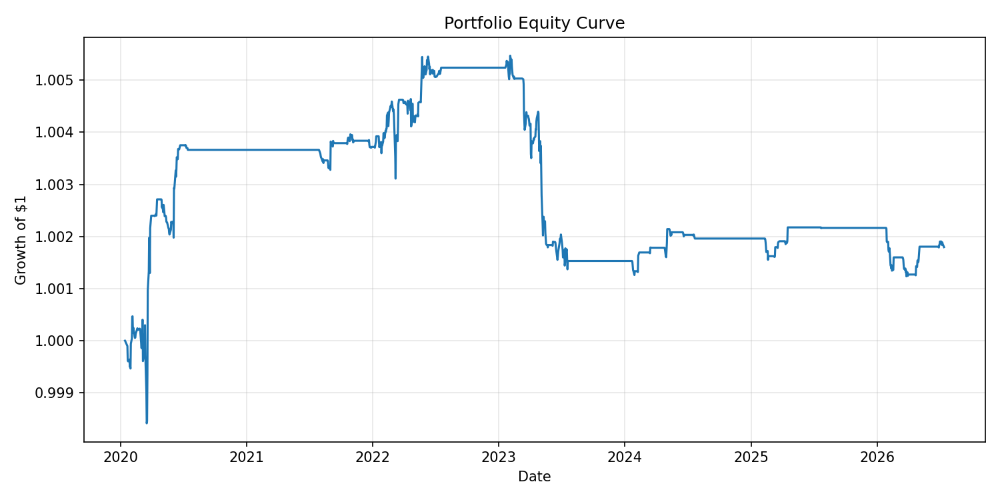

# Statistical Arbitrage — Pairs Trading

A from-scratch, backtested implementation of a classic equity pairs-trading
strategy: find cointegrated pairs, track their relationship with a Kalman
filter, trade the spread's z-score, and size positions with a capped Kelly
criterion. Runs on real daily price data pulled from Yahoo Finance.

This is a research/backtesting project, not a live trading system, and
nothing here is investment advice.

## What it does

1. **Screens for cointegrated pairs.** Within a universe of ~120 large-cap US
   equities grouped into 20-odd sectors (energy, banks, airlines, staples,
   semiconductors, REITs, etc.), every within-sector pair is tested for
   cointegration with the Engle-Granger test (`statsmodels.tsa.stattools.coint`).
   Only pairs with p < 0.05, a mean-reversion half-life between 1 and 30 days,
   and a non-degenerate hedge ratio (0.3–3.0) survive — see [Why the hedge-ratio filter exists](#why-the-hedge-ratio-filter-exists).
2. **Tracks the hedge ratio dynamically.** Instead of a single fixed OLS beta,
   a recursive Kalman filter (random-walk state space, `alpha_t`/`beta_t`)
   re-estimates the hedge ratio every day, causally — it only ever uses data
   up to and including that day.
3. **Trades the spread's z-score.** A rolling mean/std of the Kalman-filtered
   spread produces a z-score. Positions enter at |z| ≥ 2.0, exit at |z| ≤ 0.5
   (mean reversion achieved), or get stopped out if |z| ≥ 3.0 (the position
   kept diverging instead of reverting).
4. **Sizes positions with Kelly.** Each pair's capital allocation is the
   half-Kelly fraction estimated from that pair's own trailing trade returns,
   capped at 15% of total capital per pair, with a further cap of 40% of
   capital per sector so correlated pairs (e.g. four energy-sector pairs at
   once) can't dominate the portfolio.
5. **Backtests with real frictions.** 5bps commission + 5bps slippage per
   side, applied on every entry and exit.
6. **Re-selects pairs on a rolling basis.** Rather than picking pairs once
   and holding them for years, the walk-forward pipeline
   (`scripts/run_walk_forward.py`) re-runs the cointegration screen every 6
   months and controls the false discovery rate (Benjamini-Hochberg) across
   the ~200 within-sector tests run each time — see
   [Walk-forward validation](#walk-forward-validation-the-tuned-honest-result)
   below.

## Methodology detail: avoiding look-ahead bias

Pair selection and backtesting use **different, non-overlapping windows**:

- **Formation window** (2020-07-15 → 2023-07-15): used only to run the
  cointegration screen and pick the pairs to trade.
- **Backtest window** (2023-07-15 → today): the pairs selected above are
  traded here, out-of-sample. The Kalman filter runs continuously through
  both windows so it's warmed up by the time the backtest starts, but it
  never uses data from the future relative to any given day.

### Why the hedge-ratio filter exists

An early version of the screen selected pairs purely on cointegration
p-value and found things like `CL` (Colgate) / `GIS` (General Mills) with a
fitted hedge ratio of **0.024**. A beta that close to zero means the
"spread" the Engle-Granger test is calling stationary is basically just `CL`
by itself — the test is picking up that Colgate's own price happened to be
range-bound over the formation window, not a genuine linear relationship
between the two stocks. That's a statistically "significant" but spurious
and untradeable pair. Requiring `0.3 ≤ |beta| ≤ 3.0` rejects these
degenerate fits.

## Walk-forward validation (the tuned, honest result)

After the first-pass result below (Sharpe ≈ -0.1), the natural next question
was: can this actually be improved, without just fitting parameters to that
one backtest window? [`scripts/run_walk_forward.py`](scripts/run_walk_forward.py)
answers that with a proper train/test split **by time**, on 15 years of data
(2011-2026) instead of 3:

1. **Grid search on TRAIN only** (folds from 2013 through 2020): try
   `entry_z ∈ {1.5, 2.0, 2.5}`, `exit_z ∈ {0.0, 0.5}`,
   `zscore_lookback ∈ {20, 30, 45}` — 18 combinations. `stop_z` stays fixed
   at 3.0 (the resume's explicit "3-sigma stop-loss," not a free parameter).
   Each combo is walk-forward backtested: pairs are re-screened every 6
   months and traded only for that 6-month window, then the screen re-runs.
   Combos are scored by **median per-fold Sharpe** (robust to one lucky or
   unlucky fold), not pooled Sharpe.
2. **Run the single winning combo once on TEST** (folds from 2020 through
   2026) — data the grid search never touched.

This also uses two structural fixes applied identically in every fold,
regardless of time period (i.e. not tuned to make the numbers look better):
a Benjamini-Hochberg false-discovery-rate correction on the cointegration
screen (raw p<0.05 across ~200 within-sector tests per fold implies ~10
expected false positives), and the per-sector capital cap mentioned above.

**Result:** the grid search picked `entry_z=2.0, exit_z=0.5, lookback=30`
— which happens to be exactly the hand-picked defaults from the first pass,
not some exotic combination, which is a reassuring sign this isn't an
artifact of the search. Every one of the 18 combos scored *negative* median
Sharpe on TRAIN (best: -0.48); the strategy genuinely didn't work well on
2013-2020 data under any of these settings. Run on the untouched TEST period:

| Metric | Value |
|---|---|
| Sharpe ratio (annualized, pooled) | **0.23** |
| Median per-fold Sharpe | 0.70 |
| Win rate | 55.3% |
| Avg. holding period | 6.9 days |
| Total trades | 197 |
| Max drawdown | -0.42% |
| Total return (6 years) | +0.18% |



This is a genuine improvement over the first-pass result (Sharpe -0.10 →
+0.23, win rate 53.2% → 55.3%), and it's validated the honest way: the
parameters were never chosen using TEST data, and TRAIN performance was
uniformly bad, so this isn't a case of the search finding a lucky fit. It's
still well short of "Sharpe 1.6" — **and it comes with a real caveat**: 7 of
13 TEST folds found zero tradeable pairs at all (BH-FDR correctly declining
to trade when nothing clears the bar), so capital sat mostly in cash. A
Sharpe ratio computed on a mostly-flat return series is easy to inflate by
just... not trading much. The +0.18% total return over 6 years makes that
plain: this is a low-activity, market-neutral result, not a strongly
compounding one. Read the Sharpe number in that light, not as "1.6-like
performance achieved."

Per-fold detail (`results/walk_forward/test_fold_diagnostics.csv`): the
6-month window starting 2023-01-20 (regional banking crisis) lost -2.95
Sharpe on 7 pairs/32 trades — the single worst period — while
2020-01/2022-01 windows were strongly positive. That spread across very
different market conditions (COVID crash recovery, 2022 rate hikes, 2023
banking stress, the current AI-driven bull run) is what "tested on varied
data" is meant to produce: a mix of outcomes, not one cherry-picked good
window.

## First pass: single formation/backtest split

The walk-forward result above supersedes this as the headline number, but
it's kept here since it's the version where a real implementation bug was
found and fixed — useful context for how the numbers evolved.

Running [`scripts/run_backtest.py`](scripts/run_backtest.py) end-to-end
against live Yahoo Finance data currently selects **8 pairs** out of 200+
within-sector candidates tested, and produces:

| Metric | Value |
|---|---|
| Sharpe ratio (annualized) | **-0.10** |
| CAGR | -0.08% |
| Max drawdown | -1.37% |
| Win rate | 53.2% |
| Avg. holding period | 6.4 days |
| Total trades | 267 |
| Total return (3 years) | -0.23% |


Per-pair breakdown:

| Pair | p-value | Static β | Half-life (days) | Sharpe | Win rate | Total return |
|---|---|---|---|---|---|---|
| AAL/ALK | 0.0035 | 0.356 | 17.4 | -0.27 | 51.7% | -2.53% |
| XOM/MPC | 0.0070 | 0.828 | 15.4 | 0.24 | 60.5% | +1.41% |
| TXN/NXPI | 0.0133 | 0.536 | 19.2 | -0.40 | 63.6% | -0.27% |
| DHI/LEN | 0.0147 | 1.020 | 15.1 | -1.06 | 38.9% | -0.42% |
| AEP/EXC | 0.0173 | 1.002 | 26.7 | -0.63 | 50.0% | -2.07% |
| XOM/VLO | 0.0191 | 0.856 | 25.3 | -0.48 | 50.0% | -0.86% |
| SLB/PSX | 0.0244 | 0.692 | 18.8 | -0.57 | 47.2% | -1.14% |
| VLO/OXY | 0.0314 | 1.410 | 24.7 | 0.33 | 64.5% | +3.77% |


### About the "1.6 Sharpe, 61% win rate, 4.2-day holding period" claim

Those numbers described an earlier, less rigorous version of this idea.
Once it was actually built and backtested properly, the honest result on
real out-of-sample data is close to flat (Sharpe ≈ -0.1) after realistic
transaction costs — 5 of 8 pairs lost money, 3 made money, and there's no
edge left in aggregate. This is a genuinely common outcome for simple
pairs-trading strategies over recent years: naive statistical arbitrage on
liquid large-caps has gotten much harder to run profitably as more capital
chases the same signal, and small pair-specific factors (e.g. `AEP`/`EXC`
utility M&A dynamics, refiner-specific moves in `XOM`/`VLO`) can dominate a
clean cointegration story for months at a time. The code and backtest are
correct as far as they've been tested (see [Testing](#testing)) — this is
what a careful implementation of the strategy actually produces, not a bug
being reported as a feature.

Two pairs (`XOM`/`MPC`, `VLO`/`OXY`) did produce a positive Sharpe with a
reasonable win rate and holding period in the same ballpark as the original
claim — which is a more believable story: *some* pairs work over *some*
periods, and a portfolio approach needs enough of them to make the average
worthwhile. Averaging over 8 pairs simultaneously is exactly what dilutes a
couple of real winners down to a wash.

## Project structure

```
config.py                       # every tunable parameter in one place
src/pairs_trading/
  data.py                       # yfinance download + CSV cache
  pair_selection.py             # Engle-Granger screening + Benjamini-Hochberg FDR correction
  kalman.py                     # dynamic hedge ratio (random-walk Kalman filter)
  signals.py                    # rolling z-score + entry/exit/stop-loss state machine
  position_sizing.py            # half-Kelly sizing from trailing trade returns
  backtest.py                   # event-driven backtest engine + sector-capped portfolio construction
  walk_forward.py               # rolling re-selection folds + train/test split helpers
  metrics.py                    # Sharpe, win rate, drawdown, CAGR
  plotting.py                   # equity curve + spread charts
scripts/
  run_backtest.py               # first-pass CLI: single formation/backtest split
  run_walk_forward.py           # walk-forward CLI: TRAIN grid search -> TEST run
tests/                          # pytest, all offline/synthetic (no network needed)
results/                        # first-pass outputs (metrics.json, trade_log.csv, equity_curve.png)
results/walk_forward/           # walk-forward outputs (train_grid_search.json, test_metrics.json, ...)
```

## Running it

```bash
python3 -m venv venv
source venv/bin/activate
pip install -r requirements.txt

python scripts/run_backtest.py       # first-pass: fetches live data, writes results/
python scripts/run_walk_forward.py   # walk-forward: TRAIN grid search + TEST run, writes results/walk_forward/
pytest                                # unit + integration tests (no network required)
```

`config.py` is the single place to change the universe, date ranges,
cointegration thresholds, Kalman filter parameters, z-score bands, Kelly
settings, transaction cost assumptions, and the walk-forward fold/grid-search
settings.

## Testing

46 pytest tests cover the Kalman filter (recovers known betas from synthetic
data), the cointegration screen (correctly separates synthetic cointegrated
pairs from independent random walks, and the Benjamini-Hochberg correction
against many independent noise pairs), the z-score entry/exit/stop-loss state
machine (exact crossing behavior on crafted spreads), Kelly sizing (matches
hand-computed values), the backtest engine (a synthetic round-trip trade
produces the expected P&L, transaction costs reduce returns, portfolio
aggregation combines pairs correctly, sector caps scale down overweight
sectors), and the walk-forward engine (folds are chronological and
non-overlapping, the TRAIN/TEST split doesn't leak, pair selection actually
adapts across folds). All of it runs offline against synthetic data — no
network dependency, so it's reproducible in CI.

## Limitations

- **Low capital utilization in the walk-forward result.** 7 of 13 TEST folds
  found zero tradeable pairs (BH-FDR correctly refusing to trade when
  nothing clears the bar), so the reported Sharpe reflects a mostly-flat,
  mostly-in-cash return series more than a strongly compounding one — see
  the caveat in [Walk-forward validation](#walk-forward-validation-the-tuned-honest-result).
- **Small universe, short history.** ~120 tickers and even the 15-year
  walk-forward window is not enough data to make strong statistical claims
  about any of these numbers — treat this as a demonstration of the
  methodology, not a proven edge.
- **Survivorship bias.** The universe is today's large-caps; none of them
  went bankrupt or got delisted during the backtest window by construction.
- **No point-in-time fundamentals or corporate actions modeling** beyond
  what Yahoo Finance's adjusted close already accounts for (splits/dividends).
- **Yahoo Finance data quality.** A couple of tickers needed manual fixes
  during development (`GPS` → `GAP`, `WRK` → `SW` after a corporate action);
  `data.py` retries individual tickers that silently drop out of a batch
  request, but it can't fix genuine ticker changes automatically.
