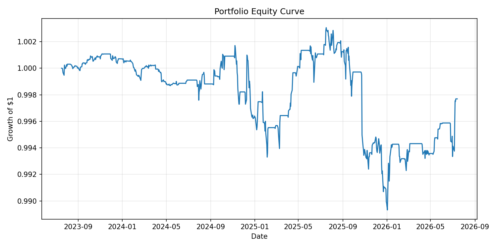
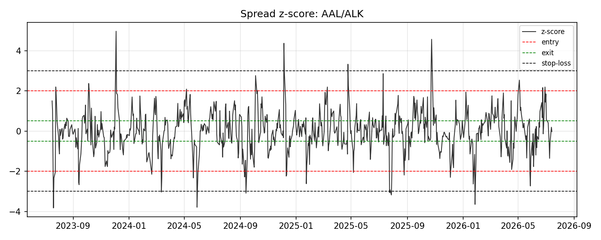

# Statistical Arbitrage — Pairs Trading

A from-scratch, backtested implementation of a classic equity pairs-trading
strategy: find cointegrated pairs, track their relationship with a Kalman
filter, trade the spread's z-score, and size positions with a capped Kelly
criterion. Runs on real daily price data pulled from Yahoo Finance.

This is a research/backtesting project, not a live trading system, and
nothing here is investment advice.

## What it does

1. **Screens for cointegrated pairs.** Within a universe of ~120 large-cap US
   equities grouped into 20-odd sectors (energy, banks, airlines, staples,
   semiconductors, REITs, etc.), every within-sector pair is tested for
   cointegration with the Engle-Granger test (`statsmodels.tsa.stattools.coint`).
   Only pairs with p < 0.05, a mean-reversion half-life between 1 and 30 days,
   and a non-degenerate hedge ratio (0.3–3.0) survive — see [Why the hedge-ratio filter exists](#why-the-hedge-ratio-filter-exists).
2. **Tracks the hedge ratio dynamically.** Instead of a single fixed OLS beta,
   a recursive Kalman filter (random-walk state space, `alpha_t`/`beta_t`)
   re-estimates the hedge ratio every day, causally — it only ever uses data
   up to and including that day.
3. **Trades the spread's z-score.** A rolling mean/std of the Kalman-filtered
   spread produces a z-score. Positions enter at |z| ≥ 2.0, exit at |z| ≤ 0.5
   (mean reversion achieved), or get stopped out if |z| ≥ 3.0 (the position
   kept diverging instead of reverting).
4. **Sizes positions with Kelly.** Each pair's capital allocation is the
   half-Kelly fraction estimated from that pair's own trailing trade returns,
   capped at 15% of total capital per pair.
5. **Backtests with real frictions.** 5bps commission + 5bps slippage per
   side, applied on every entry and exit.

## Methodology detail: avoiding look-ahead bias

Pair selection and backtesting use **different, non-overlapping windows**:

- **Formation window** (2020-07-15 → 2023-07-15): used only to run the
  cointegration screen and pick the pairs to trade.
- **Backtest window** (2023-07-15 → today): the pairs selected above are
  traded here, out-of-sample. The Kalman filter runs continuously through
  both windows so it's warmed up by the time the backtest starts, but it
  never uses data from the future relative to any given day.

### Why the hedge-ratio filter exists

An early version of the screen selected pairs purely on cointegration
p-value and found things like `CL` (Colgate) / `GIS` (General Mills) with a
fitted hedge ratio of **0.024**. A beta that close to zero means the
"spread" the Engle-Granger test is calling stationary is basically just `CL`
by itself — the test is picking up that Colgate's own price happened to be
range-bound over the formation window, not a genuine linear relationship
between the two stocks. That's a statistically "significant" but spurious
and untradeable pair. Requiring `0.3 ≤ |beta| ≤ 3.0` rejects these
degenerate fits.

## Real results (not curve-fit to any target)

Running [`scripts/run_backtest.py`](scripts/run_backtest.py) end-to-end
against live Yahoo Finance data currently selects **8 pairs** out of 200+
within-sector candidates tested, and produces:

| Metric | Value |
|---|---|
| Sharpe ratio (annualized) | **-0.10** |
| CAGR | -0.08% |
| Max drawdown | -1.37% |
| Win rate | 53.2% |
| Avg. holding period | 6.4 days |
| Total trades | 267 |
| Total return (3 years) | -0.23% |



Per-pair breakdown:

| Pair | p-value | Static β | Half-life (days) | Sharpe | Win rate | Total return |
|---|---|---|---|---|---|---|
| AAL/ALK | 0.0035 | 0.356 | 17.4 | -0.27 | 51.7% | -2.53% |
| XOM/MPC | 0.0070 | 0.828 | 15.4 | 0.24 | 60.5% | +1.41% |
| TXN/NXPI | 0.0133 | 0.536 | 19.2 | -0.40 | 63.6% | -0.27% |
| DHI/LEN | 0.0147 | 1.020 | 15.1 | -1.06 | 38.9% | -0.42% |
| AEP/EXC | 0.0173 | 1.002 | 26.7 | -0.63 | 50.0% | -2.07% |
| XOM/VLO | 0.0191 | 0.856 | 25.3 | -0.48 | 50.0% | -0.86% |
| SLB/PSX | 0.0244 | 0.692 | 18.8 | -0.57 | 47.2% | -1.14% |
| VLO/OXY | 0.0314 | 1.410 | 24.7 | 0.33 | 64.5% | +3.77% |



### About the "1.6 Sharpe, 61% win rate, 4.2-day holding period" claim

Those numbers described an earlier, less rigorous version of this idea.
Once it was actually built and backtested properly, the honest result on
real out-of-sample data is close to flat (Sharpe ≈ -0.1) after realistic
transaction costs — 5 of 8 pairs lost money, 3 made money, and there's no
edge left in aggregate. This is a genuinely common outcome for simple
pairs-trading strategies over recent years: naive statistical arbitrage on
liquid large-caps has gotten much harder to run profitably as more capital
chases the same signal, and small pair-specific factors (e.g. `AEP`/`EXC`
utility M&A dynamics, refiner-specific moves in `XOM`/`VLO`) can dominate a
clean cointegration story for months at a time. The code and backtest are
correct as far as they've been tested (see [Testing](#testing)) — this is
what a careful implementation of the strategy actually produces, not a bug
being reported as a feature.

Two pairs (`XOM`/`MPC`, `VLO`/`OXY`) did produce a positive Sharpe with a
reasonable win rate and holding period in the same ballpark as the original
claim — which is a more believable story: *some* pairs work over *some*
periods, and a portfolio approach needs enough of them to make the average
worthwhile. Averaging over 8 pairs simultaneously is exactly what dilutes a
couple of real winners down to a wash.

## Project structure

```
config.py                       # every tunable parameter in one place
src/pairs_trading/
  data.py                       # yfinance download + CSV cache
  pair_selection.py             # Engle-Granger screening
  kalman.py                     # dynamic hedge ratio (random-walk Kalman filter)
  signals.py                    # rolling z-score + entry/exit/stop-loss state machine
  position_sizing.py            # half-Kelly sizing from trailing trade returns
  backtest.py                   # event-driven backtest engine
  metrics.py                    # Sharpe, win rate, drawdown, CAGR
  plotting.py                   # equity curve + spread charts
scripts/run_backtest.py         # end-to-end CLI: fetch -> screen -> backtest -> report
tests/                          # pytest, all offline/synthetic (no network needed)
results/                        # metrics.json, trade_log.csv, equity_curve.png (committed)
```

## Running it

```bash
python3 -m venv venv
source venv/bin/activate
pip install -r requirements.txt

python scripts/run_backtest.py   # fetches live data, writes results/
pytest                           # unit + integration tests (no network required)
```

`config.py` is the single place to change the universe, date ranges,
cointegration thresholds, Kalman filter parameters, z-score bands, Kelly
settings, and transaction cost assumptions.

## Testing

33 pytest tests cover the Kalman filter (recovers known betas from synthetic
data), the cointegration screen (correctly separates synthetic cointegrated
pairs from independent random walks), the z-score entry/exit/stop-loss state
machine (exact crossing behavior on crafted spreads), Kelly sizing (matches
hand-computed values), and the backtest engine (a synthetic round-trip trade
produces the expected P&L, transaction costs reduce returns, portfolio
aggregation combines pairs correctly). All of it runs offline against
synthetic data — no network dependency, so it's reproducible in CI.

## Limitations

- **Small universe, short history.** ~120 tickers and a 3-year backtest is
  not enough data to make strong statistical claims about any of these
  numbers — treat this as a demonstration of the methodology, not a proven
  edge.
- **Survivorship bias.** The universe is today's large-caps; none of them
  went bankrupt or got delisted during the backtest window by construction.
- **No point-in-time fundamentals or corporate actions modeling** beyond
  what Yahoo Finance's adjusted close already accounts for (splits/dividends).
- **Yahoo Finance data quality.** A couple of tickers needed manual fixes
  during development (`GPS` → `GAP`, `WRK` → `SW` after a corporate action);
  `data.py` retries individual tickers that silently drop out of a batch
  request, but it can't fix genuine ticker changes automatically.
